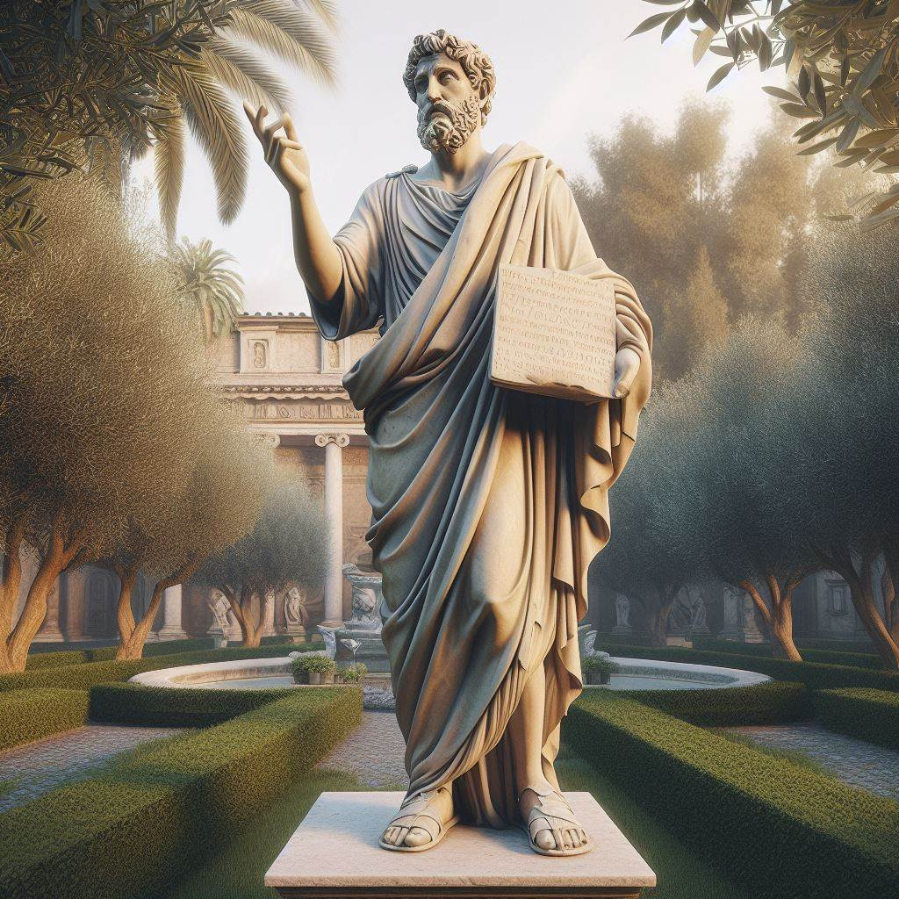

# Ooit was ik groot en blij. Nu is het onrustig met mij in de wei

    Nebukadnezar. In Daniël 4:30 wordt Nebukadnezar de koning van Babel genoemd. Hij was de koning die een tijd(7 jaar) als een beest leefde.

[Pick a new card](../random.md)
