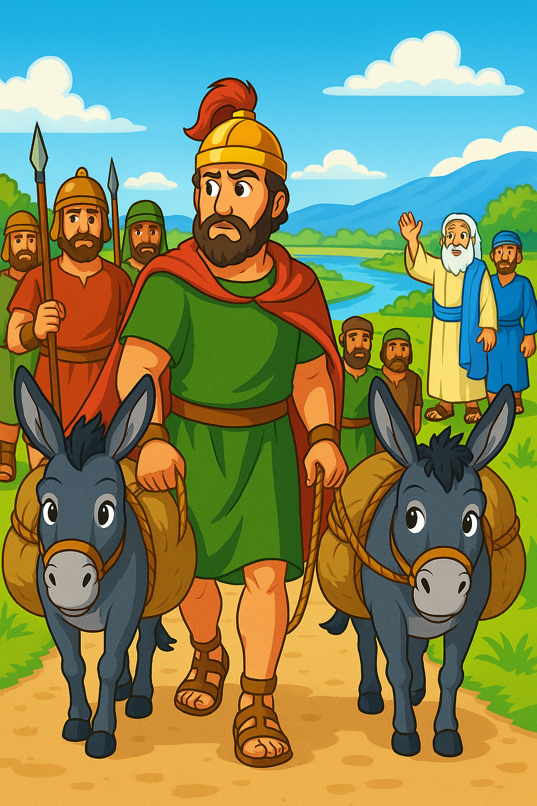

# Het jeukte op mijn rug, nu sjokken mijn ezels wel erg langzaam terug

    

        

            
        

        

            

                2 Koningen 5: Naaman, na zijn genezing, vraagt of hij aarde mee mag nemen
            

        

    

[Pick a new card](../random.md)
